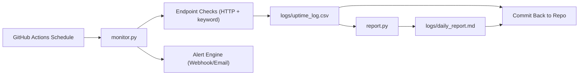

# Daily Website Health Monitoring with CI/CD

A lightweight DevOps project that checks website/API uptime on schedule, logs history, and sends failure alerts.

## Features

- Scheduled health checks using GitHub Actions (`every 15 minutes`)
- Manual run support (`workflow_dispatch`)
- Uptime history logging in CSV
- Alerting on status change (Down and Recovered):
  - Slack/Teams via webhook (recommended)
  - Email via SMTP (optional)
- Daily uptime report generation
- Basic CI tests for quality

## Project Structure

```text
.
|-- .github/workflows/
|   |-- ci.yml
|   |-- monitor.yml
|   `-- daily-report.yml
|-- config/
|   `-- sites.json
|-- logs/
|   `-- .gitkeep
|-- tests/
|   `-- test_monitor.py
|-- monitor.py
|-- report.py
`-- requirements.txt
```

## How It Works

1. `monitor.py` reads targets from `config/sites.json`
2. It checks each endpoint (HTTP status, latency, optional keyword)
3. It appends results to `logs/uptime_log.csv`
4. It detects status changes from previous logs:
   - Up -> Down: sends failure alert
   - Down -> Up: sends recovery alert
5. `report.py` builds `logs/daily_report.md` summary

## Architecture Flow



## 1) Configure Targets

Edit `config/sites.json`:

```json
{
  "sites": [
    {
      "name": "Example",
      "url": "https://example.com",
      "expected_status": 200,
      "timeout_seconds": 10,
      "keyword": "Example Domain"
    }
  ]
}
```

## 2) Configure Alerts (GitHub Secrets)

In your repo: `Settings -> Secrets and variables -> Actions`

### Option A (Recommended): Webhook Alert

- `ALERT_WEBHOOK_URL`: Slack/Teams incoming webhook URL

### Option B: Email Alert

- `SMTP_HOST`
- `SMTP_PORT` (example `587`)
- `SMTP_USERNAME`
- `SMTP_PASSWORD`
- `ALERT_FROM_EMAIL`
- `ALERT_TO_EMAIL`

If both webhook and email are configured, both channels are used.

## 3) Run Locally

```bash
python monitor.py
python report.py
```

Generated files:
- `logs/uptime_log.csv`
- `logs/daily_report.md`

## 4) GitHub Actions

- `monitor.yml`
  - Runs every 15 minutes
  - Logs results
  - Commits updated logs and report back to repo
- `daily-report.yml`
  - Runs daily at 00:05 UTC
  - Regenerates report and commits changes
- `ci.yml`
  - Runs tests on push and PR

## Viva Talking Points (High-Score Friendly)

- Why CI/CD for monitoring: no extra server cost, auditable runs, quick setup
- Reliability controls: timeout, keyword validation, status checks, recovery alerts
- Alert-noise reduction: only notify on state change
- Observability: latency + uptime logs + generated report
- Extensibility: can add Telegram, Discord, PagerDuty, Prometheus later

## Evaluation Checklist Mapping

- Scheduled checks using CI/CD: `monitor.yml` cron + dispatch
- Sends alerts on failure: webhook/email from `monitor.py`
- Logs uptime history: `logs/uptime_log.csv`

---

Tip: For demo, add 2 real endpoints (one website + one public API), then show logs and workflow history.
